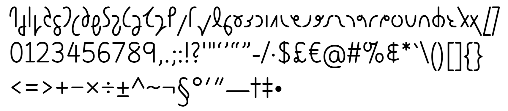

# Quintessence

This is a font for the Quikscript alphabet, in the style of idealised handwriting. The Quikscript letters are based on the writing samples found in the Quikscript Manual; no liberties were taken with their design. All glyphs are monolinear with rounded endings, in order to get as close as possible to their unadorned skeletons. It contains the complete Quikscript alphabet in its community-standard Private Use Area encoding, plus a few other punctuation marks and symbols necessary for typesetting simple documents in English.

## Software requirements

- Ensure Inkscape, Python and FontForge are installed, and all are in your PATH environment variable (so they can be invoked from the command line).
- From the root of the repo, run the command `pip install -r requirements.txt` to install the necessary Python packages.

## Building

To build the fonts from scratch, using the provided Windows batch files, run `build.bat`; this produces the intermediate source in UFO format and then builds the final OpenType (TTF and WOFF2) fonts. If you wish, run `test.bat` to see Font Bakery's test results for the fonts.

To easily add or modify glyphs:

1. Edit or create the SVG file `[glyph_name].svg`, in the folder `source\glyphs`
2. Run `step1.bat`; this produces an SFD file in the `source\temp` folder containing all of the drawn glyphs
3. With the master source file `Quintessence-MASTER.sfd` open in the same instance of FontForge as the temporary file, manually copy and paste the required glyphs and make any adjustments as required